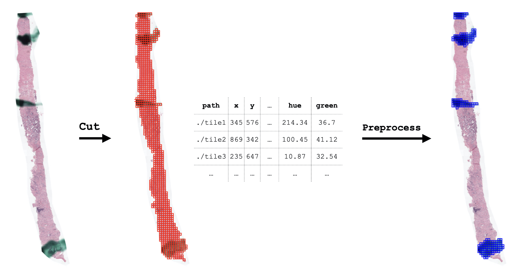

<div align="center">

# HistoPrep
Preprocessing large medical images for machine learning made easy!

<p align="center">
    <a href="#version" alt="Version">
        </a>
    <a href="#licence" alt="Licence">
        </a>
    <a href="#docs" alt="Docs">
        </a>
    <a href="#issues" alt="Issues">
        </a>
    <a href="#activity" alt="Activity">
        </a>
</p>

<p align="center">
  <a href="#description">Description</a> •
  <a href="#installation">Installation</a> •
  <a href="https://histoprep.readthedocs.io/en/latest/">Documentation</a> •
  <a href="#how-to-use">How To Use</a> •
  <a href="#examples">Examples</a> •
  <a href="#whats-coming">What's coming?</a>
</p>

</div>


## Description

This module allows you to easily **cut** and **preprocess** large histological slides.

- Cut tiles from large slide images.
- Dearray TMA spots (and cut tiles from individual spots).
- Preprocess extracted tiles **easily**.




## Installation

First install `OpenCV` and `OpenSlide` on your system (instructions [here](https://docs.opencv.org/master/d0/d3d/tutorial_general_install.html) and [here](https://openslide.org/download/)).

```bash 
pip install histoprep
```

Detailed installation instructions can be found from `HistoPrep` [docs](https://histoprep.readthedocs.io/en/latest/install.html). 

## How To Use

``HistoPrep`` has a few simple commands that do most of the heavy lifting.

```python
import histoprep as hp

# Cutting tiles is done with two lines of
cutter = hp.Cutter('/path/to/slide', width=512, overlap=0.25, max_background=0.7)
metadata = cutter.save('/path/to/output_folder')
```

If you have many slides to process, you can also use `HistoPrep` as an excecutable for easy cutting.

```bash
python3 path/to/HistoPrep cut ./input_dir ./output_dir --width 512 --overlap 0.25 --img_type jpeg
```


After the tiles have been saved, preprocessing is just a simple outlier detection from the preprocessing metrics saved in `metadata`!

```python
from histoprep import preprocess

all_metadata = preprocess.collect_metadata('/path/to/output_folder')

blurry_tiles = all_metadata['sharpness_max'] < 10
pen_markings = all_metadata['hue_0.1'] < 120
weird_blue_shit = all_metadata['blue_0.05'] > 160
```

## Examples

Detailed examples can be found in the [docs](https://histoprep.readthedocs.io/en/latest/) or the [examples](./examples) folder.

## What's coming?

`HistoPrep` is under constant development. If there are some features you would like to be added, just submit an [issue](https://github.com/jopo666/HistoPrep/issues) and we'll start working on the feature!

#### Requested features:

- [ ] Cutting and preprocessing for multichannel images (currently supports only `RGB`-images).
- [ ] Add automatic detection of outliers from `metadata`.
  - This could be implemented with dimensionality reduction.


## Citation

If you use `HistoPrep` in a publication, please cite the github repository.

```
@misc{histoprep2021,
  author = {Pohjonen J. and Ariotta. V},
  title = {HistoPrep: Preprocessing large medical images for machine learning made easy!},
  year = {2021},
  publisher = {GitHub},
  journal = {GitHub repository},
  howpublished = {\url{https://github.com/jopo666/HistoPrep}},
}
```

## Changelog

Can be found [here](CHANGELOG.md).