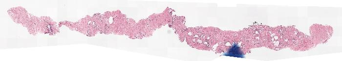
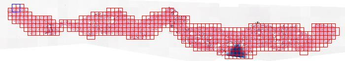
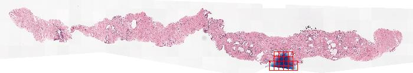

<div align="center">

# HistoPrep
Preprocessing large medical images for machine learning made easy!

<p align="center">
  <a href="#description">Description</a> •
  <a href="#installation">Installation</a> •
  <a href="#usage">Usage</a> •
  <a href="https://jopo666.github.io/HistoPrep/">API Documentation</a> •
  <a href="#citation">Citation</a>
</p>

</div>

## Description

`HistoPrep` makes is easy to prepare your histological slide images for deep
learning models. You can easily cut large slide images into smaller tiles and then
preprocess those tiles (remove tiles with shitty tissue, finger  marks etc).

## Installation 

Install [`OpenSlide`](https://openslide.org/download/) on your system and then install histoprep with `pip`!

```bash
pip install histoprep
```

## Usage

Typical workflow for training deep learning models with histological images is the
following:

1. Cut each slide image into smaller tile images.
2. Preprocess smaller tile images by removing tiles with bad tissue, staining artifacts.
3. Overfit a pretrained ResNet50 model, report 100% validation accuracy and publish it
   in [Nature](https://www.nature.com) like everyone else. 

With `HistoPrep`, steps 1. and 2. are as easy as accidentally drinking too much at the
research group christmas party and proceeding to work remotely until June.

Let's start by cutting a slide from the
[PANDA](https://www.kaggle.com/c/prostate-cancer-grade-assessment) kaggle challenge into
small tiles. 

```python
from histoprep import SlideReader

# Read slide image.
reader = SlideReader("./slides/slide_with_ink.jpeg")
# Detect tissue.
threshold, tissue_mask = reader.get_tissue_mask(level=-1)
# Extract overlapping tile coordinates with less than 50% background.
tile_coordinates = reader.get_tile_coordinates(
    tissue_mask, width=512, overlap=0.5, max_background=0.5
)
# Save tile images with image metrics for preprocessing.
tile_metadata = reader.save_regions(
    "./train_tiles/", tile_coordinates, threshold=threshold, save_metrics=True
)
```
```
slide_with_ink: 100%|██████████| 390/390 [00:01<00:00, 295.90it/s]
```

Let's take a look at the output and visualise the thumbnails.

```bash
jopo666@~$ tree train_tiles
train_tiles
└── slide_with_ink
    ├── metadata.parquet       # tile metadata
    ├── properties.json        # tile properties
    ├── thumbnail.jpeg         # thumbnail image
    ├── thumbnail_tiles.jpeg   # thumbnail with tiles
    ├── thumbnail_tissue.jpeg  # thumbnail of the tissue mask
    └── tiles [390 entries exceeds filelimit, not opening dir]
```





That was easy, but it can be annoying to whip up a new python script every time you want
to cut slides, and thus it is recommended to use the `HistoPrep` CLI program!

```bash
# Repeat the above code for all images in the PANDA dataset!
jopo666@~$ HistoPrep --input './train_images/*.tiff' --output ./tiles --width 512 --overlap 0.5 --max-background 0.5
```

As we can see from the above images, histological slide images often contain areas that
we would not like to include into our training data. Might seem like a daunting task but
let's try it out!


```python
from histoprep.utils import OutlierDetector

# Let's wrap the tile metadata with a helper class.
detector = OutlierDetector(tile_metadata)
# Cluster tiles based on image metrics.
clusters = detector.cluster_kmeans(num_clusters=4, random_state=666)
# Visualise first cluster.
reader.get_annotated_thumbnail(
    image=reader.read_level(-1), coordinates=detector.coordinates[clusters == 0]
)
```


I said it was gonna be easy! Now we can mark tiles in cluster `0` as outliers and
start overfitting our neural network! This was a simple example but the same code can be
used to cluster all several _million_ tiles extracted from the `PANDA` dataset and discard
outliers simultaneously!

## Citation

If you use `HistoPrep` to process the images for your publication, please cite the github repository.

```
@misc{histoprep,
  author = {Pohjonen, Joona and Ariotta, Valeria},
  title = {HistoPrep: Preprocessing large medical images for machine learning made easy!},
  year = {2022},
  publisher = {GitHub},
  journal = {GitHub repository},
  howpublished = {https://github.com/jopo666/HistoPrep},
}
```
