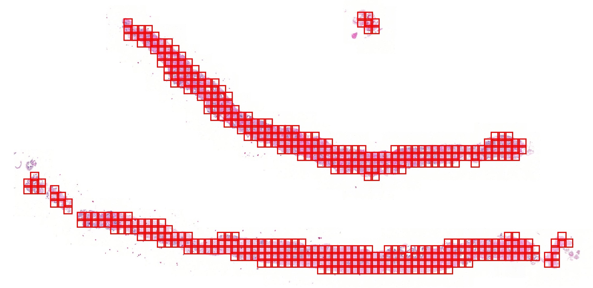
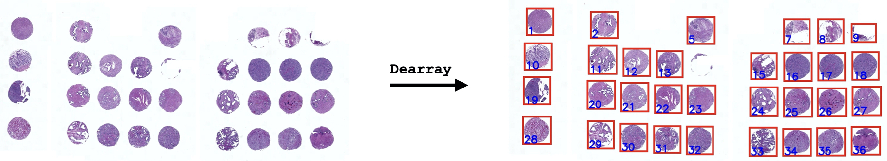
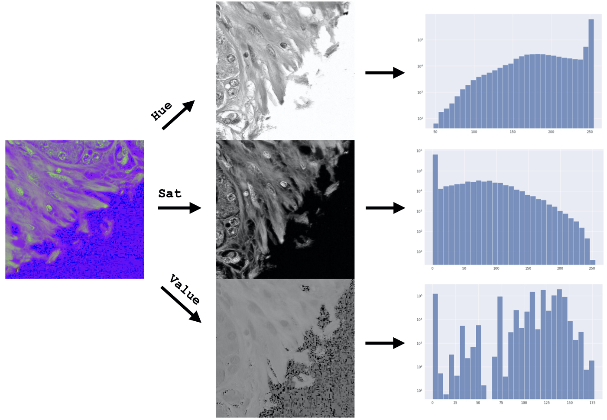
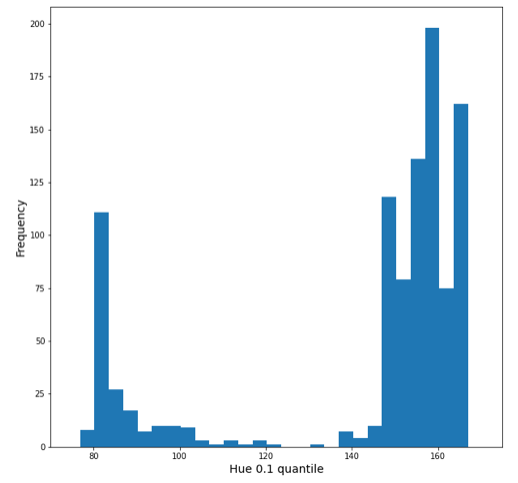
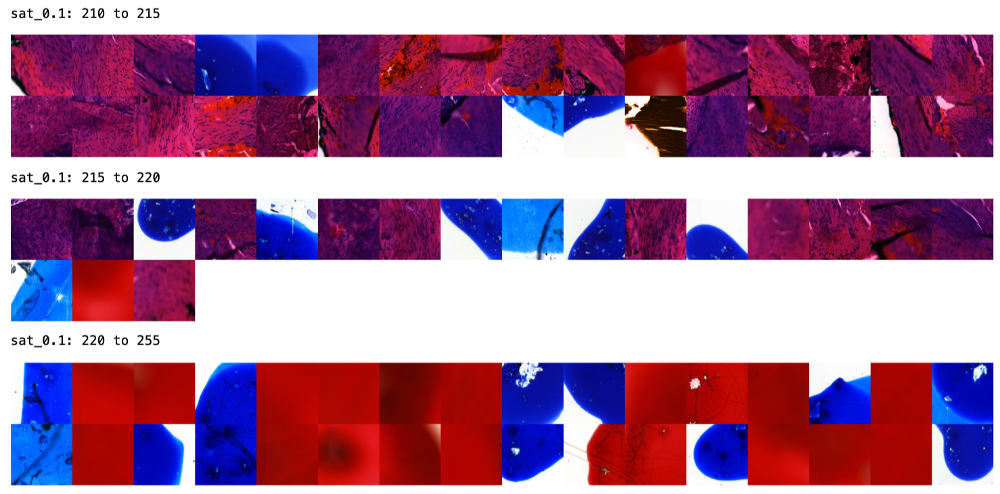
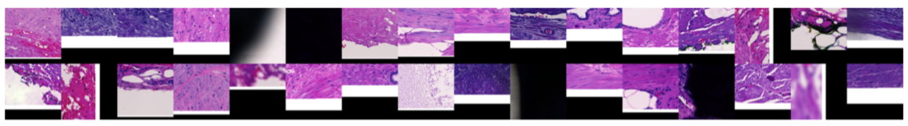

How to use ``HistoPrep``?
=========================

Before large medical slides can be fed to a machine learning model of your choosing, we must **cut** the images into manageable tiles and then **preprocess** these tiles to detect tiles we don't want to include in the training set.

.. image:: _static/workflow.jpeg

.. note::
    Recommended practice is to use the ``HistoPrep`` module inside a jupyter-notebook. This enables easy visualizations to find optimal parameters for cutting and outlier detection.

Cutting tiles from a large histological slide.
********************************************************************************

Cutting a large image into smaller tiles for machine learning can be done with only a few lines.

.. code-block:: python

  import histoprep as hp

  cutter = hp.Cutter('/path/to/slide_1', width=512, overlap=0.25, max_background=0.7)
  cutter.get_annotated_thumbnail()

In the above example we cut out ``512x512`` pixel tiles from the image. Each tile overlaps with it's neighbours by 25% and tiles with more than 70% are discarded.

With the save function, we can save the tile images with metadata for each tile.

.. code-block:: python

  metadata = cutter.save('/path/to/output_folder')

Now all tile images and the metadata are saved inside the ``output_folder``

::

  /path/to/output_folder
  └── slide_1
      ├── images [995 entries exceeds filelimit, not opening dir]
      ├── metadata.csv
      ├── summary.txt
      ├── thumbnail_32.jpeg
      └── thumbnail_annotated.jpeg

When ``HistoPrep`` saves the tile images, useful preprocessing metrics are also calculated for each tile. These can then later be used to perform outlier detection. We'll take a closer look at these metrics in the preprocessing section.

.. note::
    It is recommended to check the available options for `Cutter() <https://histoprep.readthedocs.io/en/latest/#cutter>`_ in the documentation API.

What about TMA arrays?
++++++++++++++++++++++++++++++++++++++++++++++++++++++++++++++++++++++++++++++++

Tissue microarray slides often have tens or hundreds of samples from different patients. In practice, we could just cut the TMA slide as well with ``Cutter()``, but then all the tiles from different patient samples would be mixed. Therefore, if we want to separate the tiles/spots by patient, we must first dearray the TMA slide.

Lucky for you, with ``HistoPrep`` dearraying can be done with only a few lines of code!

.. code-block:: python

  dearrayer = hp.Dearrayer('/path/to/TMA_slide')
  spot_metadata = dearrayer.save_spots('/path/to/output_folder')
  tile_metadata = dearrayer.save_tiles(width=512, overlap=0.25, max_background=0.7)

And again all spot and tile images are saved under the ``output_folder`` folder.

::

  /path/to/output_folder
  └── TMA_slide
      ├── spots [32 entries exceeds filelimit, not opening dir]
      ├── spot_metadata.csv
      ├── summary.txt
      ├── metadata.csv
      ├── thumbnail_32.jpeg
      ├── thumbnail_annotated.jpeg
      └── tiles [32 entries exceeds filelimit, not opening dir]

Using ``HistoPrep`` as an excecutable
++++++++++++++++++++++++++++++++++++++++++++++++++++++++++++++++++++++++++++++++

Sometimes we have hundreds or thousands of slides to cut and it can be annoying to write python scripts to run ``HistoPrep`` for each slide... For this reason we wrote the scripts for you!

::

  python3 /path/to/HistoPrep -h

::

  usage:  python3 HistoPrep {step} {arguments}

  █  █  █  ██  ███  ███  ███  ███  ███ ███
  █  █  █ █     █  █   █ █  █ █  █ █   █  █
  ████  █  ██   █  █   █ ███  ███  ██  ███
  █  █  █    █  █  █   █ █    █  █ █   █
  █  █  █  ██   █   ███  █    █  █ ███ █

              by Jopo666 (2021)

  optional arguments:
    -h, --help  show this help message and exit

  Select one of the below:
    
      cut       Cut tiles from large histological slides.
      dearray   Dearray an tissue microarray (TMA) slide.

Preprocessing
********************************************************************************

Preprocessing is a crucial part of image analysis projects, but can sometimes be forgotten (or skipped as it can be a pain in the ass). Without preprocessing your training data is noisier and might contain biases that leads to a decreased performance on external test sets.

``HistoPrep`` aims to make preprocessing as easy as possible. When each tile is saved, several preprocessing metrics are calculated for each tile. These metrics are saved to the ``metadata``. Now we can perform simple **outlier detection** based on these metrics. Before we take a look at how to do this, let's go over the preprocessing metrics ``HistoPrep`` uses.

Metrics
++++++++++++++++++++++++++++++++++++++++++++++++++++++++++++++++++++++++++++++++

**Background**
  
- For each tile the amount of background percentage is calculated and saved in the ``background`` column.
- The background percentage used during cutting is actually an **estimation**, this is in the ``background_estimate`` column.

  - The estimation accuray is dependent ``downsample`` parameter (used to create the thumbnail). Smaller downsample means higher accuracy but slower tissue detection.
  - Only used to check if estimation is far from the actual percentage.

**Laplacian variance**

- Used to detect sharpness of the tile. Saved in ``sharpness_*`` columns.

  - Each tile is divided into 9 windows with 50% overlap. These 9 values are then reduced with different methods to provide actual values to the ``metadata``.

    - ``sharpness_min``: Higly affected by background in the tiles (Use only if you selected a low ``max_background`` value).
    - ``sharpness_mean``: Somewhat affected by background in the tiles.
    - ``sharpness_median``: Less affected by background in the tiles.
    - ``sharpness_max``: Hardly ever affected by background in the tiles (I use this 99% of the time).

**Data loss**

- Data loss can be detected by looking at the percentage sof completely white/black pixels in the tile.
- Saved in ``black_pixels`` and ``white_pixels`` columns.

**Channel quantiles (RGB, HSV, greyscale)**

- Most useful columns in the ``metadata``!
- Can be used to detect all sorts of artifacts, such as hairs, pen markings, emojis etc.
- For each channel, different quantiles are saved in respective columns.

  - Smaller quantiles are more sensitive to small outliers (even tiny hairs stand out).
  - Larger quantiels need more of the artifact to register as an outlier.

- Saved in columns ``{channel_name}_{quantile}``, ie ``hue_0.05``.

   
**Custom metrics**

- When saving the detected tiles it is possible to pass a `custom_preprocess` function that takes in a `Pillow` image and returns a dictonary with a preprocessing metric.
- This can be used to detect anything that is missed by the above metrics.

.. code-block:: python

  def detect_bubbles(image: PIL.Image.Image) -> dict:
      arr  = np.array(image)
      # Do some fancy image-analysis to detect bubbles.
      hsv = RGB_to_HSV(arr)
      transformed = fancy_transformation(hsv)
      if transformed > 42:
          return {'bubble': True}
      else:
          return {'bubble': False}

  cutter = hp.Cutter(slide_path=path,width=512)
  cutter.save('/output/dir', custom_preprocess=detect_bubbles)

Outlier detection
++++++++++++++++++++++++++++++++++++++++++++++++++++++++++++++++++++++++++++++++

Now that we have a grasp of the preprocessing metrics we can move on to outlier detection.

If you processed multiple slides, we first need to combine all preprocessing metrics under one dataframe.

.. code-block:: python

  from histoprep import preprocess

  metadata = preprocess.combine_metadata('/path/to/output_folder')

Now all that is left is to explore your dataframe and find out if some columns have outlying values! Just slice the rows (aka. tiles) you want to keep. 

.. code-block:: python

  metadata.plot.hist(y='hue_0.1', bins=20);

  width: 500

Above we can see that there are two peaks in the distribution of ``hue_0.1``. The values below 100 are actually all tiles with black pen markings! Now we could remove these rows from ``metadata`` and continue exploring for more outliers.

The ``preprocess`` module provides functions to help comb through the dataframe for outliers. All available functions can be found from the `API documentation <https://histoprep.readthedocs.io/en/latest/autoapi/histoprep/preprocess/>`_.

.. code-block:: python

  # Plot given ranges from a column.
  preprocess.plot_ranges(metadata, 'sat_0.1', 
                         ranges=[(210,215), (215,220), (220,255)])

.. code-block:: python

  # Plot random tiles from dataframe.
  preprocess.plot_tiles(metadata[metadata['black_pixels'] > 0], rows=2, cols=16)

